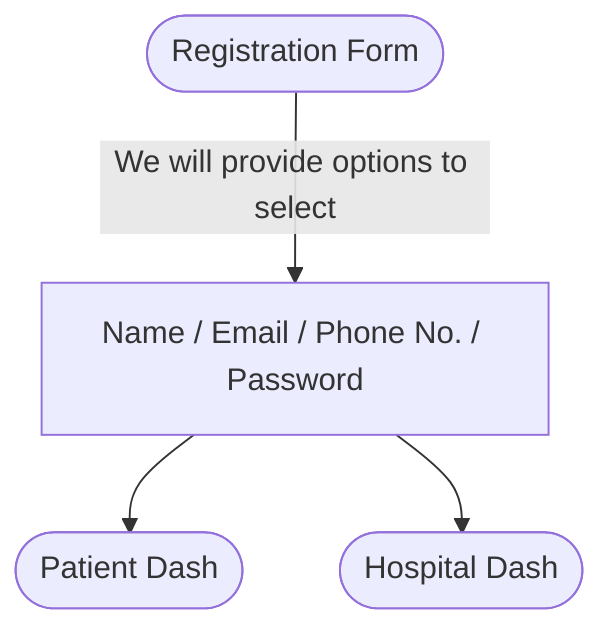
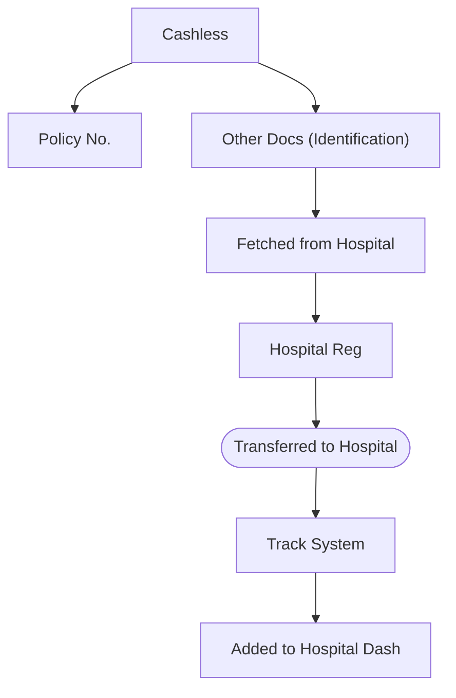
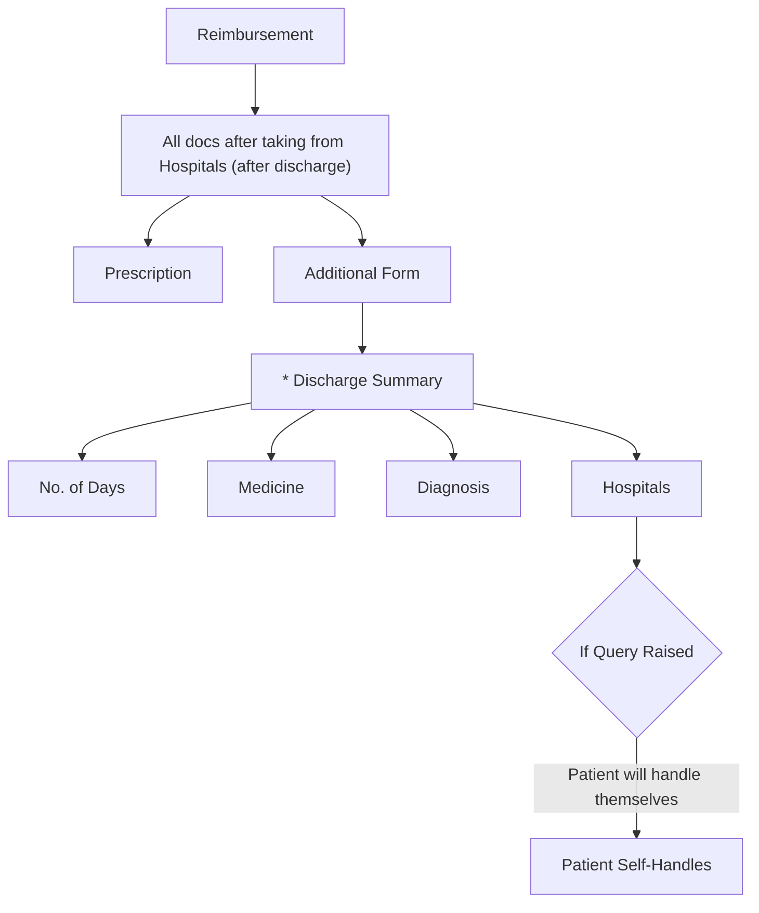
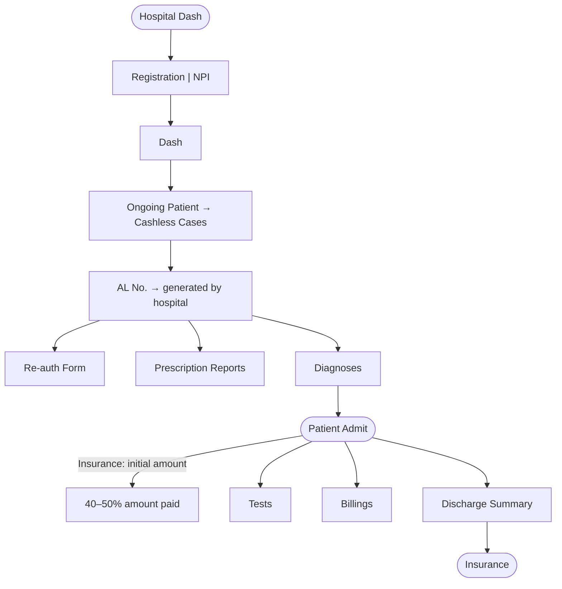
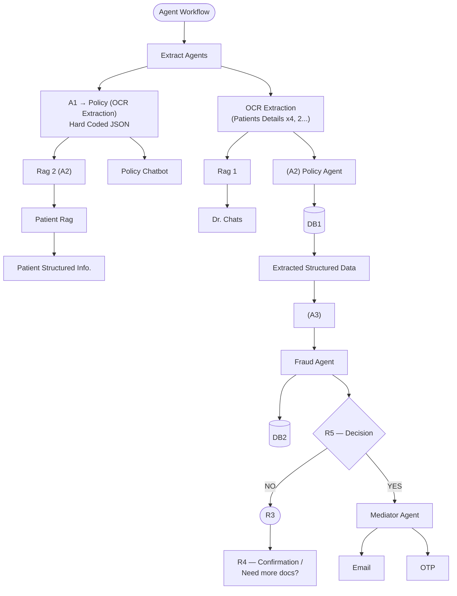
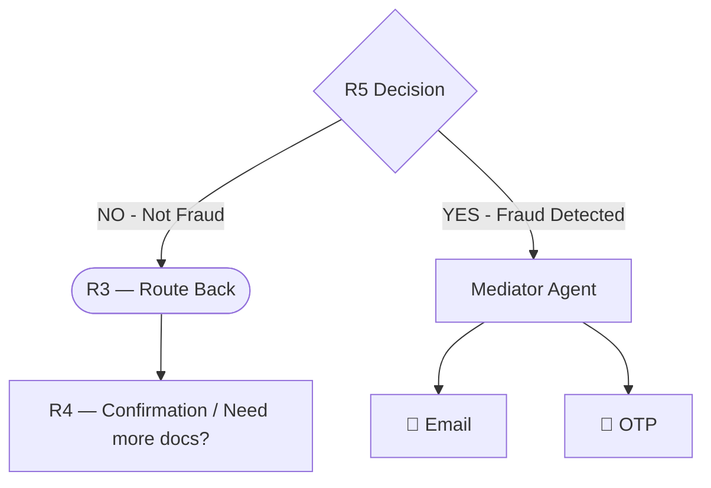
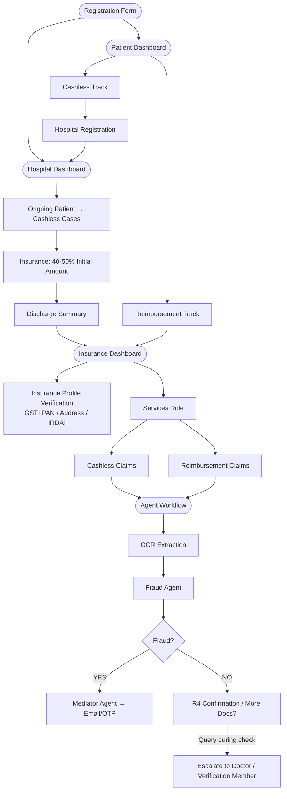

# Insurance Platform — Workflow Notes
> Extracted from handwritten e-ink tablet notes (3 pages). Structure, hierarchy, and intent preserved 1:1.

---

## Page 1 — Registration, Patient Dashboard & Hospital Dashboard

---

### 1. Registration Flow

**Registration Form Fields:**
- Name
- Email
- Phone No.
- Password

> 📝 **Note:** We will provide **options to select** on the registration form.

---

### 2. Patient Dashboard

**Fields shown on Patient Dashboard:**
- Policy No.
- Policy Name
- Policy Type
- Policy Starting / Ending Date

---

#### 2.1 Services *(MVP)*

> **MVP Features:**
> - Tracking System
> - Policy Understanding

Services split into two tracks:

---

##### 2.1.1 Cashless Track

**Required Documents:**
- Policy No.
- Other docs *(Identification)* — fetched from Hospital

**Flow:**
1. Docs fetched → **Hospital Reg**
2. Case **transferred to Hospital**
3. Appears in **Track System**
4. Case **added to Hospital Dash**

---

##### 2.1.2 Reimbursement Track

**Required Documents** *(collected after discharge from hospital):*
- All hospital documents
- Prescription
- Additional form
- **Discharge Summary** *(critical document — marked with \*)* containing:
  - No. of days
  - Medicine
  - Diagnosis
  - Hospitals

> ⚠️ **Query Handling:** If a query is raised during the reimbursement process, **the patient will handle it themselves.**

---

### 3. Hospital Dashboard

**Registration:** NPI → `trustworthy`

**Hospital Dashboard — Ongoing Patient Flow:**

| Step | Detail |
|------|--------|
| **AL No.** | Generated by hospital |
| **Re-auth Form** | Required for ongoing cases |
| **Prescription Reports** | Attached to patient record |
| **Diagnoses** | Recorded under patient admit |
| **Patient Admit** | Triggers Insurance initial amount **(40–50% of total amount)** |
| **Tests** | Conducted post-admit |
| **Billings** | Generated during stay |
| **Discharge Summary** | Final document sent to **Insurance** |

---
---

## Page 2 — Insurance Dashboard & Agent Workflow

---

### 4. Insurance Profile Verification

> **Sub-login arc** *(mentioned top-right — sub-login feature for the insurance entity)*

**Required Verification Fields:**
- GST + PAN No.
- Address
- **IRDAI License Number**

---

### 5. Insurance Dashboard

> **Data Source:** Fetches all data from **Patient Dashboard** and **Hospital Dashboard**

> 🔑 **Key Rule:** Each **Claim Process** will have a **unique ID**
> Example: `Id-claim123`

---

#### 5.1 Services Role

The Insurance Dashboard handles two service types:

- **Cashless**
- **Reimbursement**

---

#### 5.2 Cashless — Claim Management View

| Column | Column |
|--------|--------|
| **New Claim** | **Completed Claim** |
| **Pending Claim** | **Decision** |

**Routing:**
- → **Agent Workflow** *(automated processing)*
- → **Human Verification Needed** *(flagged cases)*

---

#### 5.3 Reimbursement — Claim Management View

| Column | Column |
|--------|--------|
| **New Claim** | **Completed Claim** |
| **Pending Claim** | **Decision** |

**Routing:**
- → **Agent Workflow** *(automated processing)*
- → **Human Verification Needed** *(flagged cases)*

---

### 6. Agent Workflow

> This is the core AI/ML pipeline powering automated claim processing. Both Cashless and Reimbursement feed into this unified workflow.

---

#### 6.1 Extract Agents — Breakdown

##### Agent A1 — Policy OCR Agent

- Input: **Policy Document**
- Process: **OCR Extraction** *(hard-coded JSON output)*
- Outputs to:
  - **Rag 2 (A2)** → **Patient Rag** → **Patient Structured Info.**
  - **Policy Chatbot** *(RAG-2 powered)*

##### OCR Extraction — Patient Documents

- Input: **Patients Details** *(x4, 2… — multiple patient document sources)*
- Outputs to:
  - **Rag 1** → **Dr. Chats**
  - **A2 (Policy Agent)** → **DB1** → **Extracted Structured Data**

##### Agent A2 — Policy Agent

- Reads from **DB1**
- Produces **Extracted Structured Data**
- Feeds into **A3**

##### Agent A3 — Fraud Agent

- Input: Extracted Structured Data from A2/A3 pipeline
- Writes to: **DB2**
- Routes to decision node **R5**

---

#### 6.2 Decision Routing (R3, R4, R5)

| Node | Role |
|------|------|
| **R5** | Primary fraud decision gate |
| **R3** | Re-routes when no fraud found |
| **R4** | Asks for confirmation or additional documents |
| **Mediator Agent** | Triggers communication on fraud detection |
| **Email / OTP** | Notification & verification channels |

---

#### 6.3 RAG Systems Summary

| RAG System | Connected To | Purpose |
|------------|-------------|---------|
| **Rag 1** | OCR Extraction (Patients) | Feeds **Dr. Chats** |
| **Rag 2** | A1 Policy OCR → Patient Rag | Feeds **Patient Structured Info.** + **Policy Chatbot** |

---

### 7. Future Add-on

> **[ Future Add-on ]**
>
> - **TAT Monitor** *(Turnaround Time Monitoring)*

- [ ] Implement TAT Monitor as a future module

---
---

## Page 3 — Query Escalation Note

---

### 8. Query Escalation During Model Check

> *In case of any query raised during the model check, then the case can be transferred to another* **[doctor, other verification members]**

**Escalation Rule:**
- If any query is raised during the **automated model/fraud check**, the case is **not auto-rejected**.
- It is transferred to a human reviewer — either a **Doctor** or another **Verification Team Member** for manual assessment.

---
---

## Summary — System Architecture Overview

---

*End of extracted notes.*